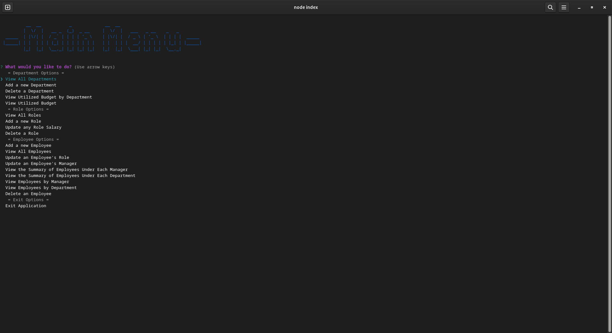
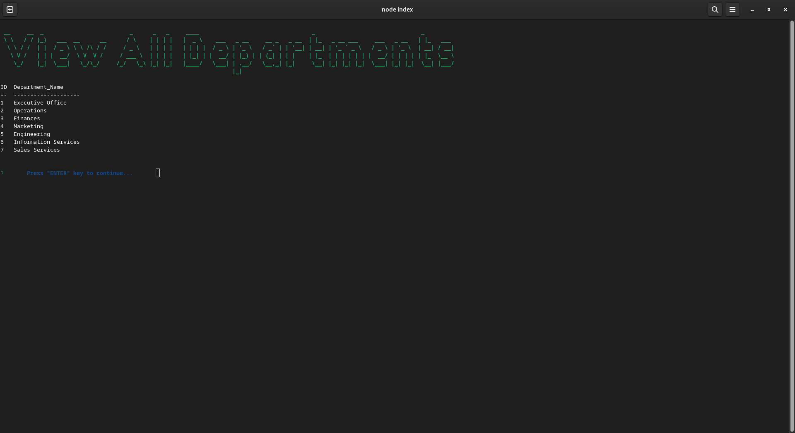
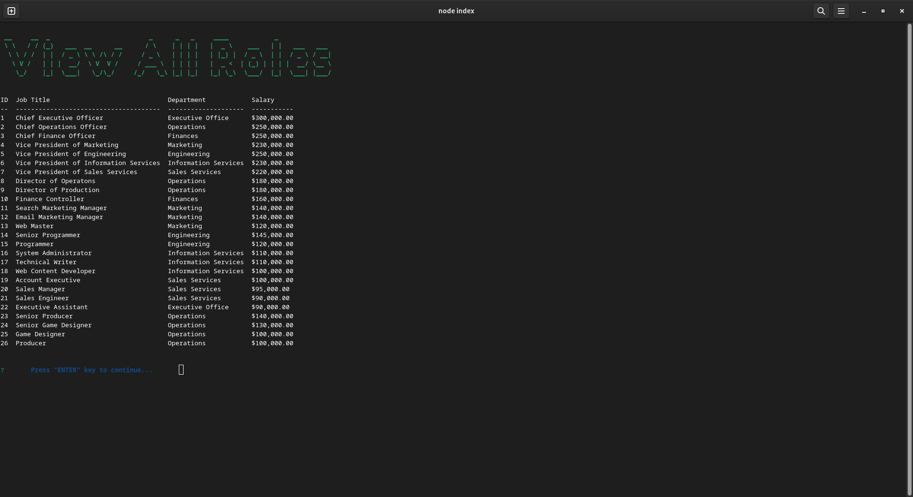
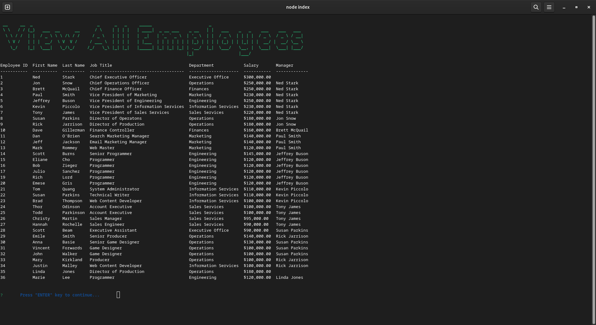
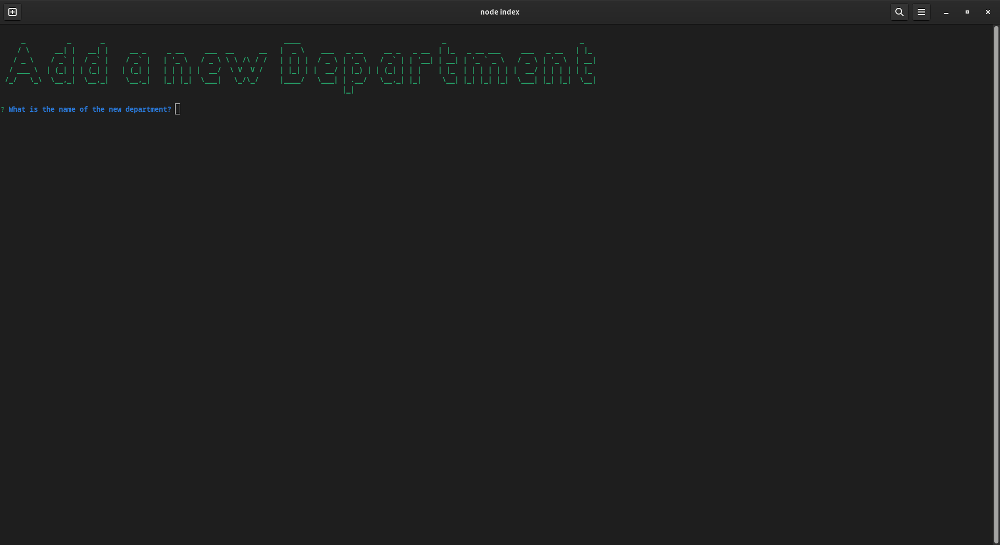
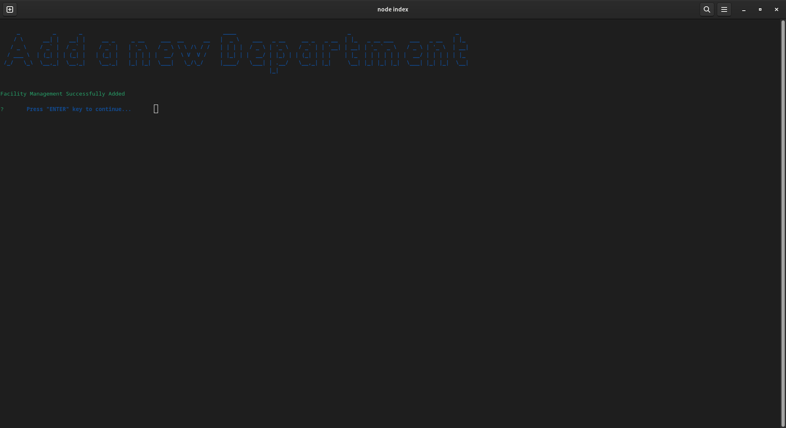
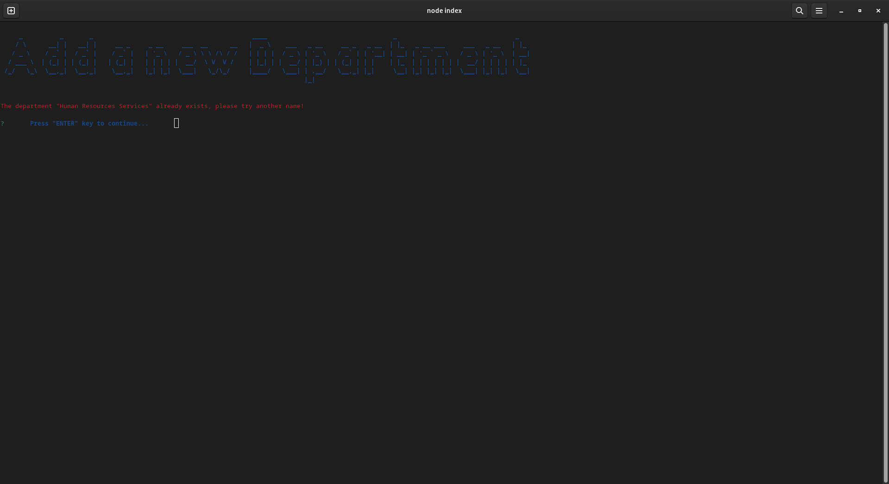
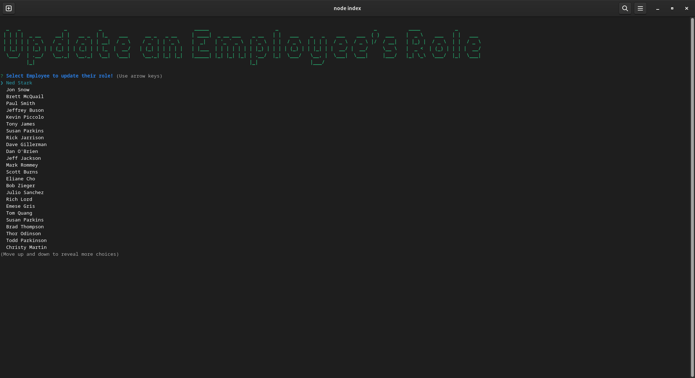

# EMPLOYEE TRACKER

     

## Description

This application is a Node.js application that uses MySQL to manage a company's employee database from the command-line. It allows the owner to add, delete, update, and read any employee's information in the database. It enables the owner to conveniently and efficiently manage their company's employees.

My objectives for this application is based on the following user story and acceptance criteria;

### User Story

```
As a business owner
I want to be able to view and manage the departments, roles, and employees in my company
So that I can organize and plan my business.

```

### Acceptance Criteria

```
GIVEN a command-line application that accepts user input

WHEN I start the application
THEN I am presented with the following options: view all departments, view all roles, view all employees, add a department, add a role, add an employee, and update an employee role
WHEN I choose to view all departments
THEN I am presented with a formatted table showing department names and department ids
WHEN I choose to view all roles
THEN I am presented with the job title, role id, the department that role belongs to, and the salary for that role
WHEN I choose to view all employees
THEN I am presented with a formatted table showing employee data, including employee ids, first names, last names, job titles, departments, salaries, and managers that the employees report to
WHEN I choose to add a department
THEN I am prompted to enter the name of the department and that department is added to the database
WHEN I choose to add a role
THEN I am prompted to enter the name, salary, and department for the role and that role is added to the database
WHEN I choose to add an employee
THEN I am prompted to enter the employee’s first name, last name, role, and manager, and that employee is added to the database
WHEN I choose to update an employee role
THEN I am prompted to select an employee to update and their new role and this information is updated in the database

```

## Table of Contents

- [Description](#description)
- [Installation](#installation)
- [Usage](#usage)
- [Features](#features)
- [Questions](#questions)
- [License](#license)

---

## Installation

To run this command-line application, you will need to install Node.js and once installed, you will run the following command in the root directory of the application:

- npm install

This command will install all dependencies found in the package.json file required by the application to execute.

## Usage

The [Employee Tracker application](https://drive.google.com/file/d/1IMjBwmN0RFQjGDPfkVqGBY1RdnFp5rCl/view?usp=share_link) is invoked by using the following command in the root directory of the application:

- node index

[This Employee Tracker link](https://drive.google.com/file/d/1IMjBwmN0RFQjGDPfkVqGBY1RdnFp5rCl/view?usp=share_link) shows a demonstration of invoking the application and its features in its root directory. The HTML file generated in the demo is included here as [index.html](./dist/index.html).

The images below shows some of the application's prompts and feedback.

The application's main menu outlining all the features available to the user.



The application uses the user selection as a headline banner while executing the requested feature. The image below presents all the department in this demonstration.



The image below presents all the roles in the company.



The image below presents all the employees in the company. The headline banner indicates the users requested feature.



The application will present a series of prompts in order to perform the requested feature. The image below presents the prompt for the user to add a new department to the company.



If the user presents all the required information from the application's prompts, then the application presents a confirmation of adding the new information to the database. The image below shows the confirmation for adding the new department to the company.



If the user presents existing or incorrect data, the application provides appropriate feedback to the user. The image below shows the error message when the user attempts to add an existing department to the database.



The application always provides valid options to the user if the request requires existing information in the database. The image below shows the application aiding the user with information when performing an update request.



## Features

In addition to fulfilling the above requirements, the application also has the following features:

1. The application all the user to update any employee's manager.
2. It also allows the user to update the salary of any role.
3. The user can view all employees under a manager or in a department.
4. It presents a summary of employees under each manager or department.
5. It allows the user to delete any employee, role or department.
6. It presents the total utilized budget of all departments or the user can select to view the budget of one department.
7. The application prevents the user from adding duplicate names of employees, roles, and departments.

## Questions

If you have any questions, please feel free to reach out to me at: [ikubiti@icloud.com](mailto:ikubiti@icloud.com).

Alternatively, you may find me on GitHub at [https://github.com/ikubiti](https://github.com/ikubiti).

---

## License

Copyright (c) ikubiti. All rights reserved.

Licensed under the [MIT](./LICENSE) license.
